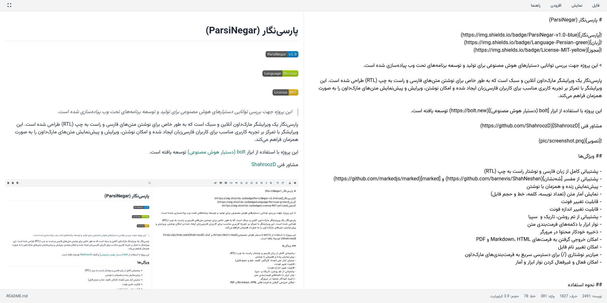

# پارسی‌نگار (ParsiNegar)


پارسی‌نگار یک ویرایشگر مارک‌داون آنلاین و سبک است که به طور خاص برای نوشتن متن‌های فارسی و راست به چپ (RTL) طراحی شده است. این ویرایشگر با تمرکز بر تجربه کاربری مناسب برای کاربران فارسی‌زبان ایجاد شده و امکان نوشتن، ویرایش و پیش‌نمایش متن‌های مارک‌داون را به صورت همزمان فراهم می‌کند.

این پروژه به طور کامل با استفاده از [v0 (دستیار هوش مصنوعی Vercel)](https://v0.dev) توسعه یافته است.



## ویژگی‌ها

- 🌐 پشتیبانی کامل از زبان فارسی و نوشتار راست به چپ (RTL)
- 👁️ پیش‌نمایش زنده و همزمان با نوشتن
- 📊 نمایش آمار متن (تعداد کاراکتر، کلمه، خط و حجم فایل)
- 🎨 قابلیت تغییر فونت (وزیرمتن و Iranian Sans)
- 🌓 پشتیبانی از تم روشن و تاریک
- 🔢 نمایش شماره خطوط
- 📝 نوار ابزار با دکمه‌های فرمت‌بندی متن
- 💾 ذخیره خودکار محتوا در مرورگر
- 📤 امکان خروجی گرفتن به فرمت‌های Markdown و HTML
- 🔄 پشتیبانی از مفسرهای مختلف مارک‌داون (Marked و ShahNeshan)

## نحوه استفاده

### استفاده آنلاین

برای استفاده آنلاین از پارسی‌نگار، کافی است به وب‌سایت پروژه مراجعه کنید: [پارسی‌نگار](https://alirho.github.io/ParsiNegar)

### اجرای محلی

برای اجرای پارسی‌نگار به صورت محلی روی سیستم خود، مراحل زیر را دنبال کنید:

1. مخزن پروژه را کلون کنید:
```bash
git clone https://github.com/[نام-کاربری-شما]/ParsiNegar.git

```

2. به دایرکتوری پروژه بروید:

```shellscript
cd ParsiNegar
```

3. فایل `index.html` را در مرورگر خود باز کنید یا از یک سرور محلی استفاده کنید.


### راهنمای استفاده

1. متن مارک‌داون خود را در پنل سمت راست بنویسید.
2. پیش‌نمایش متن به صورت همزمان در پنل سمت چپ نمایش داده می‌شود.
3. از دکمه‌های نوار ابزار برای فرمت‌بندی سریع متن استفاده کنید.
4. برای تغییر تنظیمات (فونت، تم، مفسر و...) روی آیکون چرخ‌دنده کلیک کنید.
5. برای خروجی گرفتن از متن، از دکمه‌های خروجی در بالای پنل پیش‌نمایش استفاده کنید.


## توسعه

برای مشارکت در توسعه پارسی‌نگار:

1. ابتدا پروژه را فورک کنید.
2. یک شاخه جدید برای ویژگی یا اصلاح خود ایجاد کنید.
3. تغییرات خود را اعمال کنید.
4. یک درخواست ادغام (Pull Request) ارسال کنید.


## مجوز

این پروژه تحت مجوز MIT منتشر شده است.
